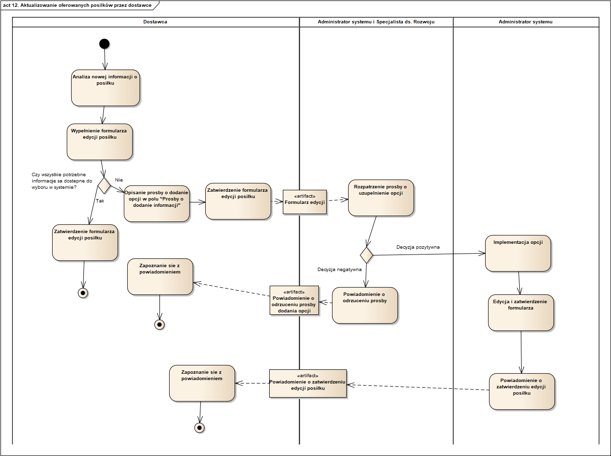

11. Dodawanie posiłków przez dostawcę
Formularz dodania posiłku do oferty jest dostępny z poziomu zakładki z oferowanymi przez dostawcę zamówieniami. W tym celu musi podać dane w formularzu dotyczące posiłku, w szczególności kaloryczność, informacje o wartościach odżywczych, rodzaj kuchni, opis, zdjęcie. Ponadto sprzedawca określa możliwy termin dostawy, obejmujący określenie dni tygodnia, godzin dostawy oraz minimalnej ilości zamówień dla danego posiłku. Jeżeli dodawany posiłek posiada cechy, wymagające dodania nowej opcji do wybrania takich kategorii jak kuchnia, typ diety, rodzaj posiłku, dostawca zgłasza prośbę o dodanie w polu "Prośby o dodanie" formularza. Formularz po zatwierdzeniu trafia do Administratora systemu, który razem ze Specjalistą ds. Rozwoju rozpatruje prośbę, w przypadku stwierdzenia potrzeby dodania nowej opcji implementuje ją, edytuje formularz według prośby dostawcy i zatwierdza. Następnie zatwierdza formnularz i powiadamia o dodaniu opcji i posiłku dostawcę.

12. Aktualizowanie oferowanych posiłków przez dostawcę
Opcja edycji posiłku jest dostępna w zakładce aplikacji zawierającej oferowane zamówienia. Po wybraniu opcji edycji dostawca zostaje przekierowany do formularza zawierającego dane zapisane w systemie. Dostawca dokonuje niezbędnych zmian, następnie zatwierdza formularz. Jeżeli edytowanie posiłku wymaga podania opcji, niedostępnej do wyboru, w takich kategoriach jak kuchnia, typ diety, rodzaj posiłku, dostawca zgłasza prośbę o dodanie w polu formularza "Prośby o dodanie". Formularz jest rozpatrywany przez Administratora systemu i Specjalistaę ds. Rozwoju. W przypadku stwierdzenia potrzeby dodania nowej opcji Administrator implementuje opcję, odpowiednio zmienia dane w formularzu i zatwierdza formularz edycji. Po czym informuje dostawcę, że posiłek został zaktualizowany.

13. Zgłaszanie przez klienta skargi na dostawcę
Opcja złożenia skargi jest dostępna w historii zamówień, odnosi się do konkretnego zamówienia. Klient wypełnia odpowiedni formularz, w którym opisuje swoją skargę. Podaje informację o typie problemu, opisuje zdarzenie. Skarga trafia do Specjalisty ds. Obsługi Klienta, który po zweryfikowaniu skargi kontaktuje się z dostawcą. W trakcie kontaktu pracownik dokładnie opisuje problem i oczekiwania wobec dostawcy w celu rozwiązania sytuacji. Dostawca podejmuje działania w celu rozwiązania problemu. Klient zostaje poinformowany o działaniach wobec dostawcy i krokach, podjętych do rozwiązania problemu oraz przyznaczonej mu rekompensacji. Sprawa rozwiązania skargi jest dokumentowana w ogólnym raporcie skarg odpowiedniej kategorii.

