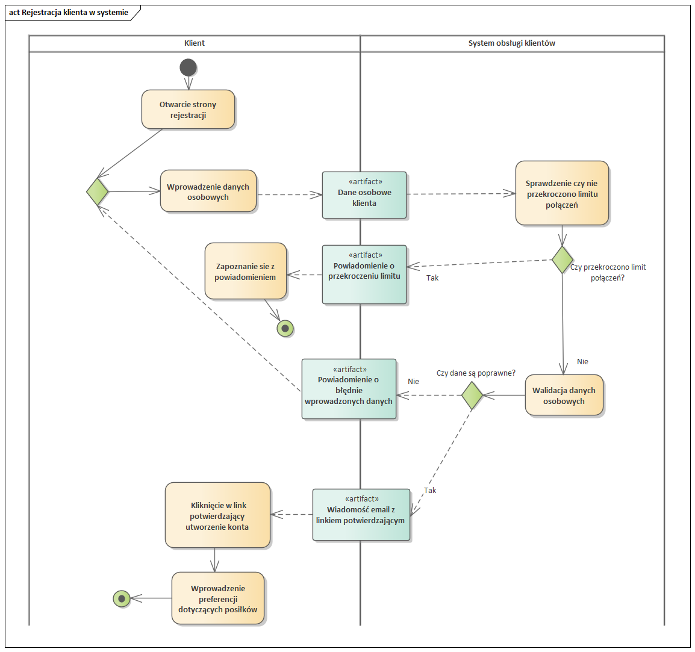
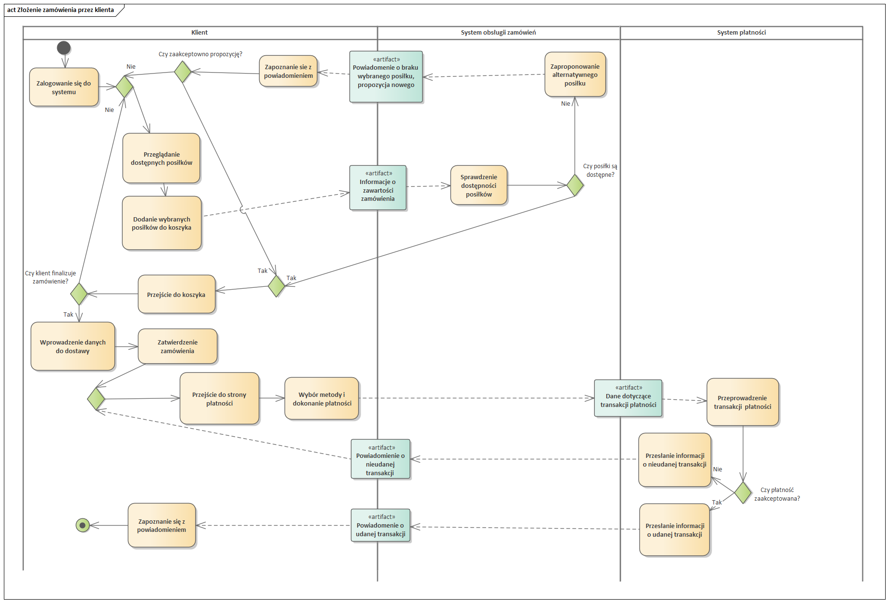

## Rejestracja dostawcy w systemie

Proces rejestracji dostawcy w systemie rozpoczyna się od momentu, gdy administrator systemu otwiera stronę rejestracji dostawcy. Administrator wprowadza dane dostawcy, takie jak nazwa firmy, adres itp., a następnie zatwierdza te dane. Jeżeli wprowadzone dane są poprawne, adminitrator inicuje połączenie z API dostawcy aby informacje o produktach były pobierane automatycznie. Te informacje są następnie aktualizowane w systemie, co umożliwia klientom przeglądanie i zamawianie produktów dostawcy. Jeśli API odmówiło połączenia, admistrator ponawia próbę aż do skutku, prawdiłowe połączenie jest niezbędne do zatwierdzenia profilu dostawcy.Na końcu procesu, rzecznik biznesowy przekazuje dane logowania do dostawcy. W ten sposób, proces rejestracji dostawcy w systemie zapewnia, że wszystkie informacje o dostawcy są dokładne i aktualne, co jest kluczowe dla zapewnienia wysokiej jakości usług dla klientów.

## Rejestracja klienta w systemie

Proces rejestracji klienta w systemie rozpoczyna się od momentu, gdy klient otwiera stronę rejestracji. Klient wprowadza swoje dane, takie jak imię, nazwisko, adres e-mail itp., a także swoje preferencje dotyczące posiłków, takie jak typ diety, alergie itp. Następnie, klient zatwierdza swoje dane. Jeżeli wprowadzone dane są poprawne, system tworzy konto dla klienta i wysyła e-mail z potwierdzeniem do klienta. Klient musi kliknąć link w e-mailu, aby zweryfikować swoje konto. Po pomyślnej weryfikacji, system aktywuje konto klienta i wyświetla powiadomienie o pomyślnej aktywacji konta. Jeżeli wprowadzone dane nie są poprawne, system wyświetla błąd i prosi klienta o ponowne wprowadzenie danych. Ten proces jest powtarzany, aż do momentu, gdy wprowadzone dane będą poprawne.

## Złożenie zamównia przez klienta

Proces składania zamówienia przez klienta w systemie rozpoczyna się od momentu, gdy klient zaloguje się do systemu. Po zalogowaniu, klient przegląda dostępne posiłki. Jeżeli klient znajduje interesujące posiłki, dodaje je do koszyka.Następnie, klient przechodzi do koszyka, gdzie sprawdza szczegóły zamówienia, takie jak wybrane posiłki, ich ilość, cena itp. Klient wprowadza również dane do dostawy, takie jak adres i czas dostawy, a następnie zatwierdza zamówienie. Następnie klient przenoszony jest do strony płatności. Wybiera on metodę i dokonuje płatności. Jeżeli płatność zostaje zaakceptowana, proces składania zamówienia zostaje zakończony. Jeżeli płatność nie jest zakończona, klient jest kierowany z powrotem do strony płatności, aby spróbować ponownie.

