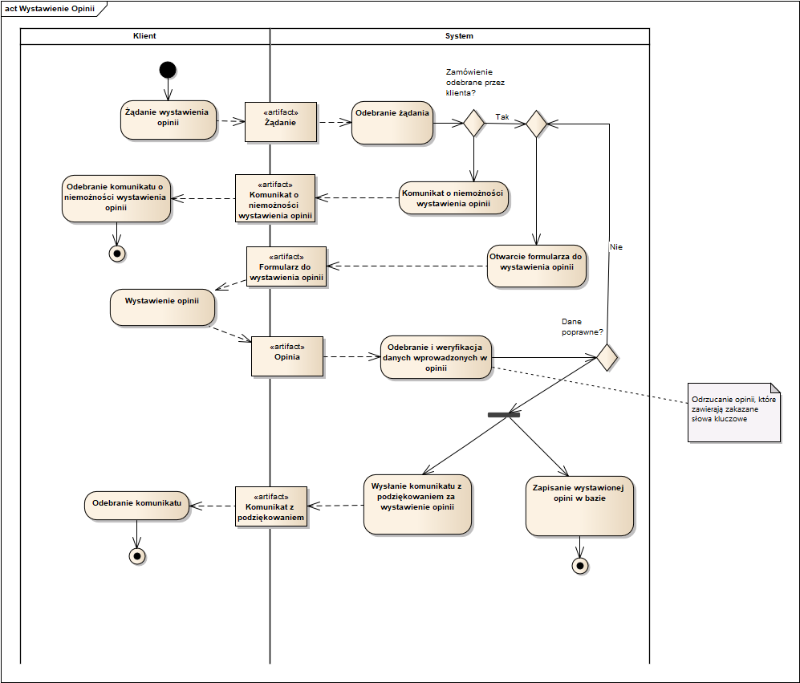

# Procesy biznesowe od 7 do 10

### 7. Wystawianie opinii przez klientów (model - Michał Szlązak, opis - Sebastian Grosfeld)

Klient wybiera zakładkę w aplikacji zawierającą zrealizowane zamówienia. Wybiera jedne z wyświetlanych zamówień i wybiera opcję wystawienia opinii. System weryfikuje czy zamówienie zostało odebrane przez klienta. Jeśli nie, to wyświetla odpowiedni komunikat i wraca do zrealizowanych zamówień. Jeśli tak, to system wyświetla formularz wystawienia opinii w związku z zrealizowanym zamówieniem. Klient wypełnia formularz. System weryfikuje go pod względem poprawności. Jeżeli dane wprowadzone są nie poprawne to formularz jest zwracany do poprawienia. Jeżeli klient anuluje poprawianie formularza to zostanie on odrzucony. Jeśli dane są poprawne to system wyświetli komunikat z podziękowaniem i zapisze wystawioną opinię. [Sebastian Grosfeld]

### 8. Weryfikacja opinii klienta (model - Michał Szlązak, opis - Sebastian Grosfeld)

Do systemu trafia informacja o zgłoszeniu wystawionej opinii przez klienta. System przekazuje tą informację zawierającą m.in powód zgłoszenia do wyznaczonego pracownika. Pracownik ten weryfikuje wystawioną opinię pod względem nieodpowiednich treści. Jeżeli pracownik stwierdzi że zgłoszenie jest słuszne to potwierdza zgłoszenie. Następnie opinia jest usuwana przez system. W przypadku gdy pracownik stwierdzi że zgłoszenie jest niesłuszne to odrzuca zgłoszenie, a system zachowuje opinię. [Sebastian Grosfeld]

### 9. Realizacja rozliczeń z dostawcami usług caterinowych (model - Michał Szlązak, opis - Sebastian Pietrykowski)

System gromadzi informacje dotyczące zamówień złożonych przez klientów i wysyła je do dostawcy. Następnie oczekuje na otrzymanie faktur wystawionych przez dostawcę. Otrzymane faktury są weryfikowane co do zgodności danych identyfikacyjnych, produktów, cen i kwoty do zapłaty. Po dokonaniu weryfikacji, faktury są rejestrowane w systemie księgowym firmy i zatwierdzane do zapłaty. Jeśli wszystkie dane są poprawne, faktury są akceptowane do płatności. W przypadku jakichkolwiek nieprawidłowości, konieczne może być skontaktowanie się z dostawcą w celu wyjaśnienia sytuacji. Następnie firma dokonuje płatności dla dostawcy w formie przelewu bankowego. Do dostawcy wysyłane jest potwierdzenie przelewu. [Sebastian Pietrykowski]

### 10. Zarządzanie zamówieniami posiłków (model - Michał Szlązak, opis - Sebastian Pietrykowski)

System przyjmuje zamówienia na posiłki od klientów. Po otrzymaniu zamównienia, system rejestruje je w bazie danych. System sprawdza dostępność zamówionych posiłków oraz możliwe terminy dostawy. Jeśli któryś z zamówionych posiłków jest niedostępny w danym terminie, system może zaproponować alternatywny posiłek lub inne dostępne terminy. Po weryfikacji dostępności, zamówienia są przygotowywane do realizacji. Posiłki są przygotowywane zgodnie z zamówieniem, pakowane i dostarczane do klientów. Gdy dostawa wyrusza do klienta dostaje on powiadomienie w aplikacji. [Sebastian Pietrykowski]
