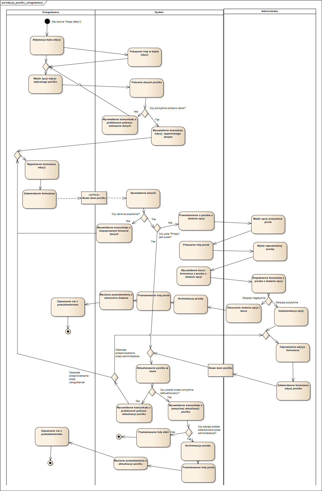
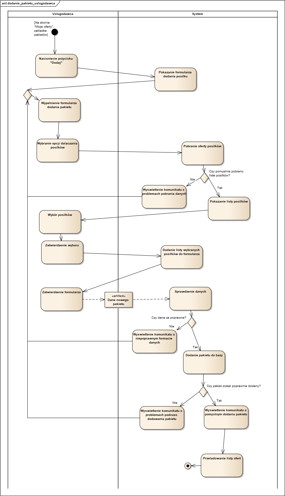
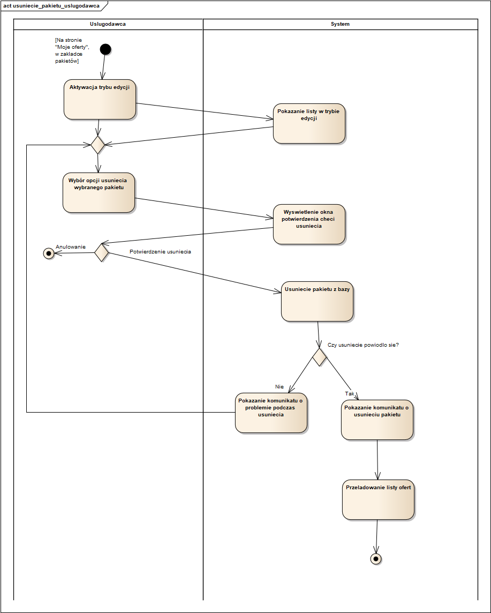
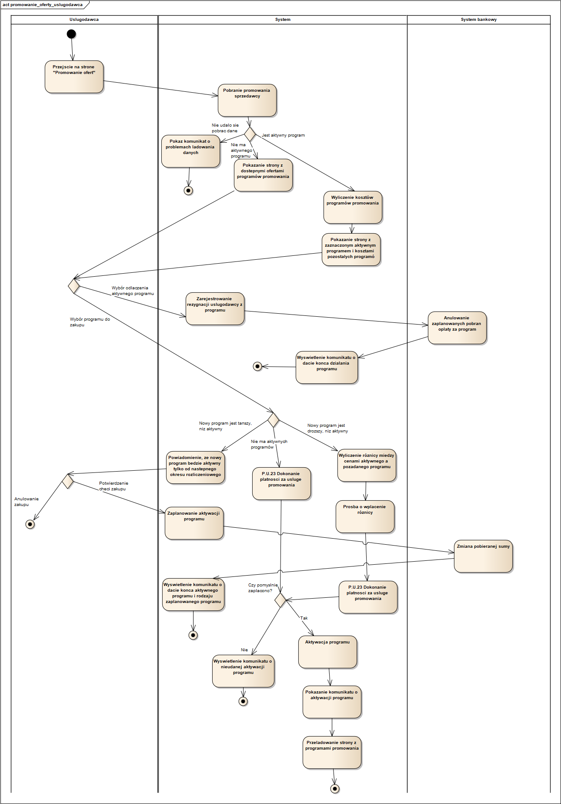

##12. Zarejestrowanie się w systemie za pomocą konta Microsoft, Google lub Apple  ##

##13. Zalogowanie się do systemu za pomocą konta Microsoft, Google lub Apple ##

##14. Przejrzenie oferty posiłków ##

##15. Przejrzenie oferty pakietów ##

##16. Dodanie posiłku do oferty ##

##17. Edycja posiłku z oferty ##

##18. Usunięcie posiłku z oferty ##

##19. Dodanie pakietu posiłków do oferty ##

##20. Edycja pakietu posiłków ##

##21. Usunięcie pakietu posiłków z oferty ##

##22. Promowanie oferty ##

