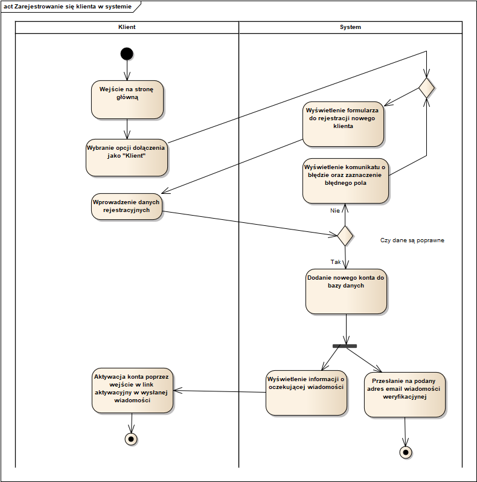
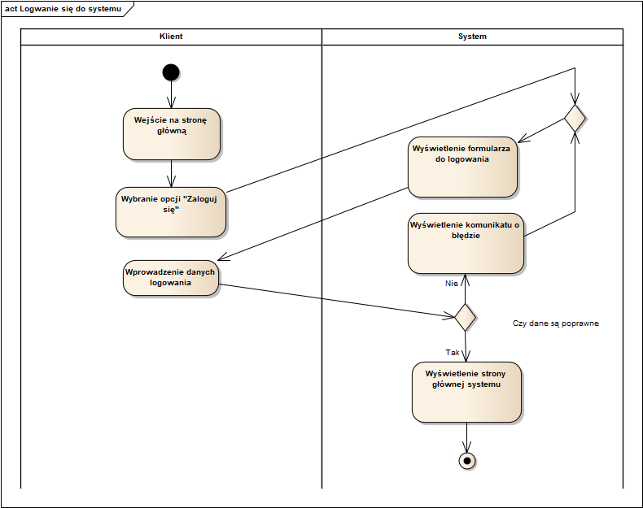
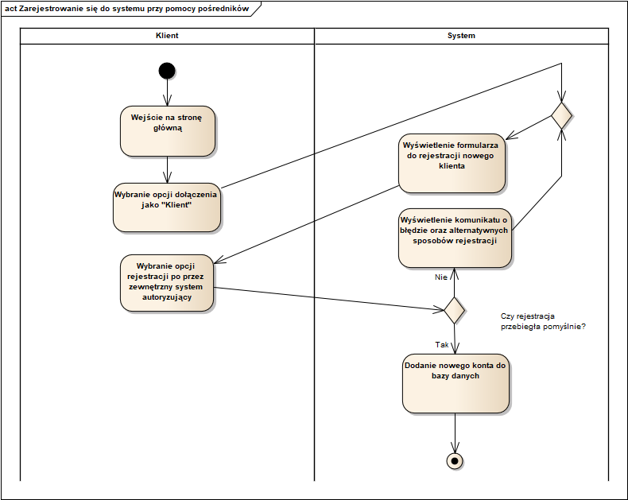
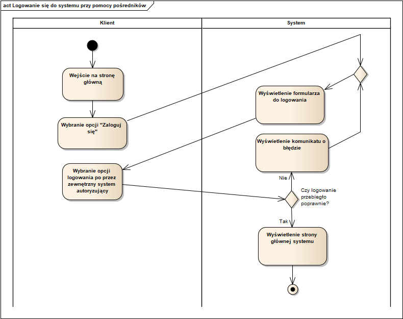
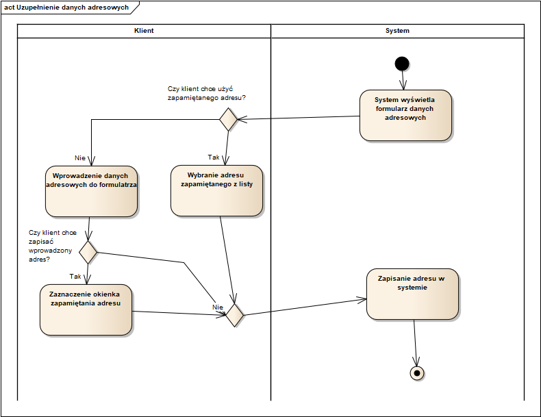
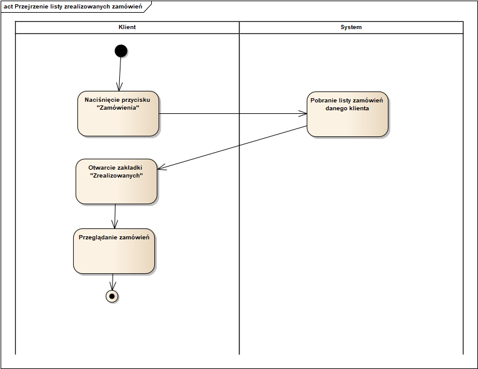
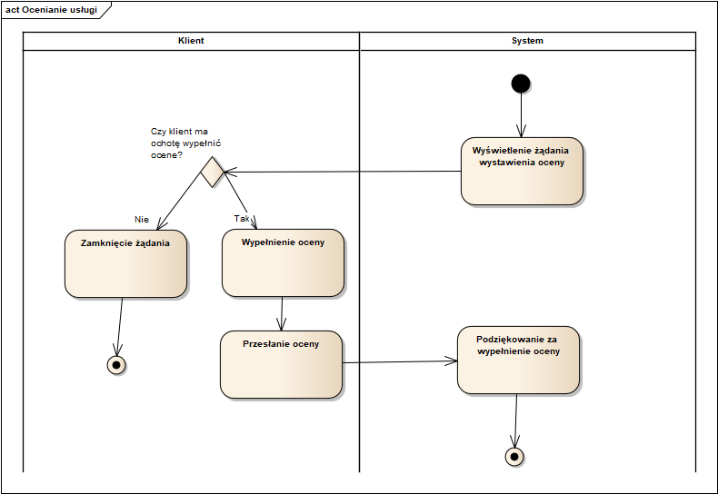
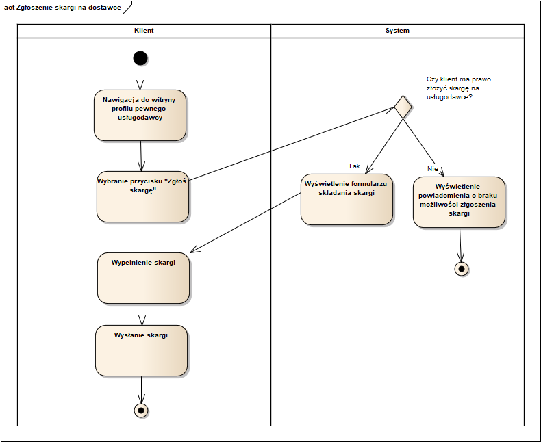
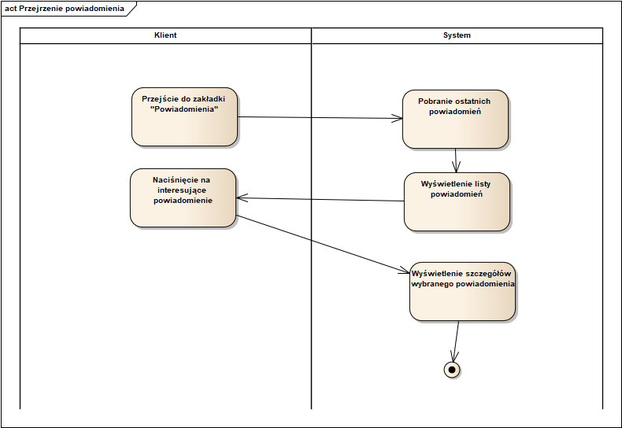
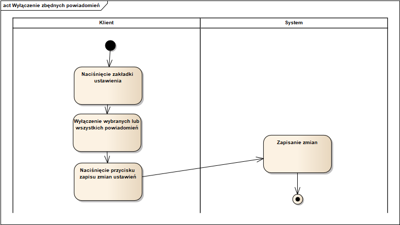

##34. Zarejestrowanie się w systemie##

##35. Zalogowanie się do systemu##

##36. Zarejestrowanie się w systemie za pomocą konta Microsoft, Google lub Apple##

##37. Zalogowanie się do systemu za pomocą konta Microsoft, Google lub Apple##

##38. Uzupełnienie danych adresowych##

##39. Przejrzenie listy zrealizowanych zamówień##

##40. Ocenienie usługi##

##41. Zgłoszenie skargi na dostawce##

##42. Wystawienie opinii na temat usługi##

##43. Przejrzenie powiadomienia##

##44. Wyłączenie zbędnych powiadomień##
