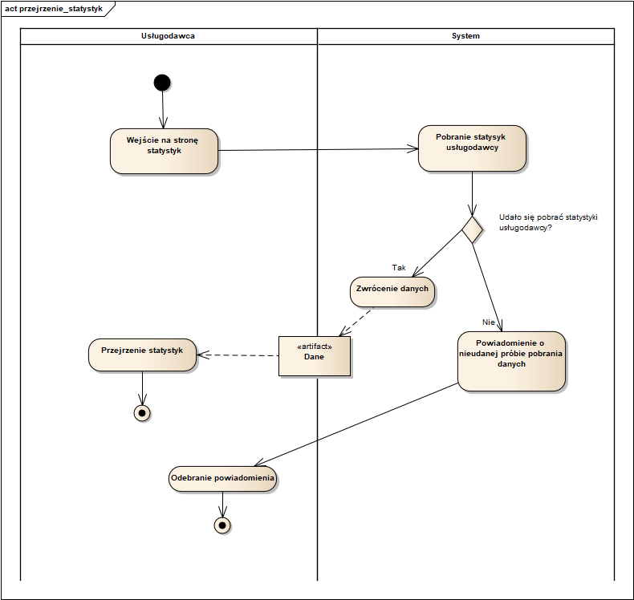

# Diagramy czynności od 23 do 33

### 7. Wystawianie opinii przez klientów (model - Michał Szlązak, opis - Sebastian Grosfeld)

### 23. Dokonanie płatności za usługę promowania

### 24. Przejrzenie statystyk

### 25. Przejrzenie recenzji

### 26. Zgłoszenie opinii

### 27. Przejrzenie obecnie aktywnych zamówień klientów

### 28. Oznaczenie zamówienia jako "w drodze"

### 29. Przejrzenie koszyka

### 30. Rezygnacja z subskrypcji

### 31. Usunięcie posiłku

### 32. Wybranie innego terminu dostawy

### 33. Wybranie innego posiłku

